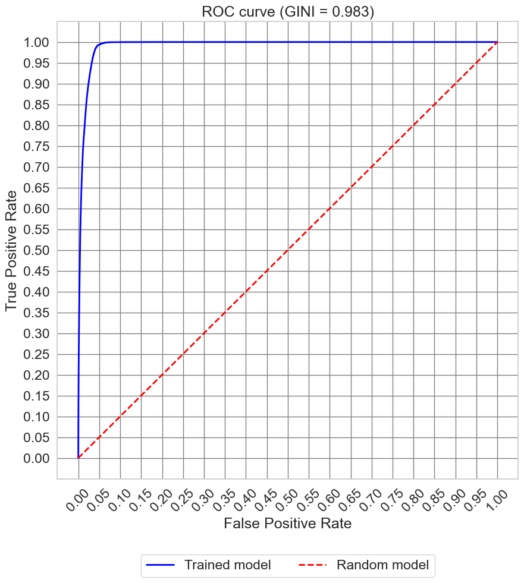
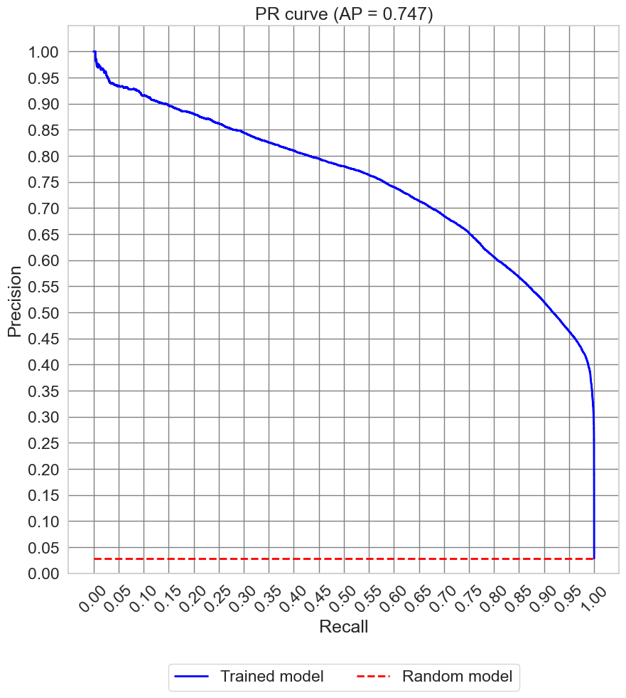
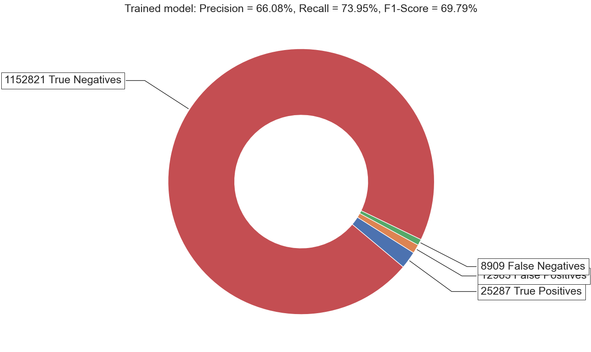

# Задача

## Разработка модели предсказания потери почтовых отправлений

Весь процесс доставки — от приема в отделении до вручения получателю — состоит из большого числа операций. Отправление запаковывают, перевозят на склад и транспортируют между сортировочными пунктами. Если доставка едет из-за границы, то дополнительно появляются операции на зарубежной и российской таможне.

Ускорить и удешевить доставку помогают крупные логистические хабы. Там мелкие грузы сортируются и отправляются в соседние регионы или собираются в новые контейнеры для отправки в другие макрорегионы. Таким образом, почтовые отправления путешествуют по сети сортировочных центров, как кровь по капиллярам, и в конце концов добираются в любые точки нашей страны.

Несмотря на высокий уровень системы безопасности, по-прежнему остается риск пропаж или порчи отправлений: перемещений и операций с посылками очень много, кроме того, в процессе может сыграть человеческий фактор.

Точное предсказание пропаж и их локализация позволит повысить надежность системы — гарантировать доставку отправлений в срок и снизить расходы на транспортировку. Предлагаем участникам чемпионата решить эту задачу — разработать модель предсказания потери почтовых отправлений.

https://lk.hacks-ai.ru/758467/champ


# Решение

Ноутбук для соревнования: [](https://colab.research.google.com/github/DmitriyKhodykin/PochtaRF_Competition/blob/main/main.ipynb)

### Итоговый результат

```
Evaluation parameter	| Validation sample	| Test sample
-------------------------------------------------------
Competition-score     | 0.9663            | 0.9331
AUC-score	            | 0.9914	          | 0.9860
Precision	            | 0.6608	          | 0.6506
Recall	              | 0.7395	          | 0.4571
F1-score	            | 0.6979	          | 0.5370
```

### ROC-кривая



### ROC/PR-кривая



### F1-чарт



